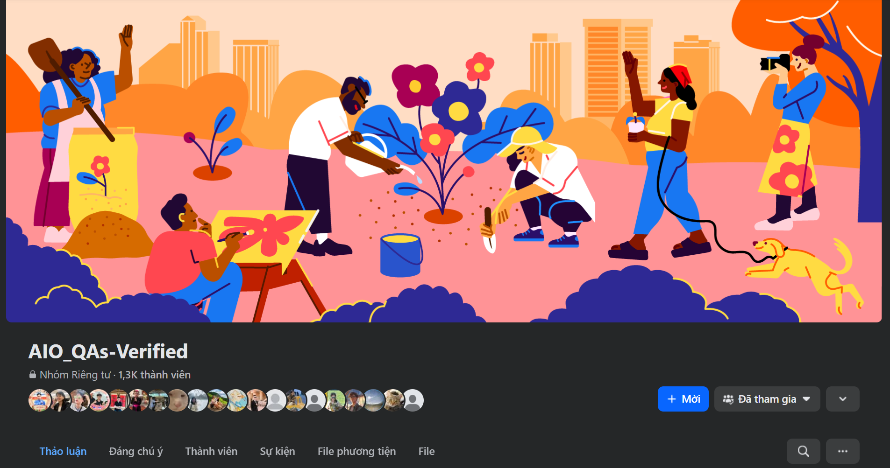

## 🙅‍♂️ Tuesday: Skills for AIO 2025

This class provided foundational guidance for AIO 2025, focusing on core academic and technical skills necessary for research and  AI development.

**Instructor: Vinh Dinh Nguyen, PhD**

---

### 🔍 Part 1: How to Do Research Effectively

### **1. Finding Research Papers**

Several platforms where students can search for scholarly resources are introduced:

- **Google Scholar** ([scholar.google.com](https://scholar.google.com/)): General academic search engine.
- **IEEE Xplore:** For computer science and engineering papers.
- **PubMed:** Biomedical and life sciences literature.
- **Springer / ScienceDirect:** Broader access to multidisciplinary journals.
- **arXiv / bioRxiv:** Preprint archives for computer science, physics, and biology.
- **PapersWithCode:** Combines papers with code implementations.
- **AIO Q&A Facebook Group:** A community forum for peer support and competition insights

<aside>
💡

Some sources may require institutional access to view full papers. If your university or institution account doesn’t support this, you can go to the AIO group on Facebook to ask for supports.

</aside>

### **2. Reading Scientific Documents**

This section introduces the structured reading strategies and how we can utilize LLM to support academic reading:

- **Key Sections** to prioritize: Title, Abstract, Introduction, Related Work, Proposed Method, and Experimental Results.
- **Guidelines by ChatGPT**: A 7-step process including skimming, analyzing methods, interpreting tables, and discussing with peers.
- **NotebookLM:** Upload and summarize academic papers interactively

### **3. Making a Research Plan**

This section shows how to generate a research plan using **Gemini AI**, including:

- Literature review techniques.
- Identifying key models, benchmarks, and evaluation metrics.
- Defining next research steps and using structured prompts to frame ideas clearly.

### 💻 Part 2: Basic Programming (Python) Skills for AIO Projects

This portion introduced tools and techniques for implementing and documenting Python code.

### **1. Coding Environments**

- **Jupyter Notebook** and **Google Colab** were demonstrated.
- Installation methods via Python or Anaconda.
- Instructions to create, save, and reopen notebooks.
- Integration with **Google Drive** for loading and processing files (e.g., displaying images).

### **2. Using AI Assistants (Colab AI & ChatGPT)**

Hands-on examples included:

- Generating Python code and visualizations.
- Explaining code, debugging, and adding comments.
- Writing basic algorithms and summarizing technical content.

### **3. Documenting Results with LaTeX (Overleaf)**

Students practiced using **Overleaf** to:

- Write and format LaTeX documents.
- Add sections, images, tables, and formulas.
- Incorporate Vietnamese text and mathematical expressions

### 📚 Part 3: Additional Resources

[https://drive.google.com/drive/folders/1cneAdYkiMN9F9YCDPfFSqESDslbDLaCC](https://drive.google.com/drive/folders/1cneAdYkiMN9F9YCDPfFSqESDslbDLaCC)

### 1. 🛠️ **Research & Paper Tools**

- **Connected Papers** ([https://www.connectedpapers.com](https://www.connectedpapers.com/)): Visual exploration of related work and literature maps.
- **ResearchRabbit** ([https://www.researchrabbit.ai](https://www.researchrabbit.ai/)): Helps track citation networks and new publications.

### 2. 💻 **Learning Python and AI**

- **Python Tutor** ([https://pythontutor.com](https://pythontutor.com/)): Visualizes step-by-step Python execution.
- **W3Schools Python** (https://www.w3schools.com/python/): Beginner-friendly reference.

### 3. 🧪 **Experiment and Visualization**

- **Kaggle Notebooks** (https://www.kaggle.com/code): Community-shared code with real datasets.
- **Streamlit** ([https://streamlit.io](https://streamlit.io/)): Tool for quickly building interactive Python dashboards.
- **Weights & Biases** ([https://wandb.ai](https://wandb.ai/)): For experiment tracking and model logging.

### 4. 🧾 **Writing and Documentation**

- **Zotero** or **Mendeley**: Reference managers for organizing sources.
- **LaTeX Templates**: Use Overleaf Gallery for academic templates.

---